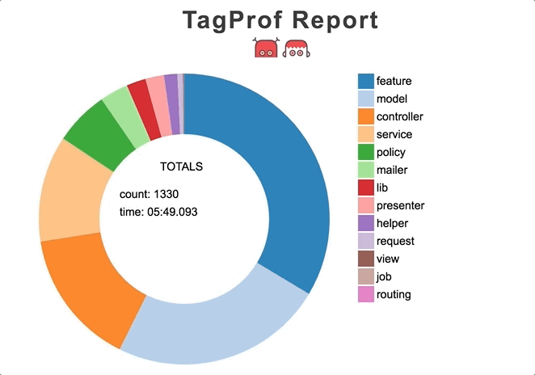

# TagProf

TagProf is a simple profiler which collects examples statistics grouped by a provided tag value.

That's pretty useful in conjunction with `rspec-rails` built-in feature – `infer_spec_types_from_location!` – which automatically adds `type` to examples metadata.

Example output:

```sh
[TEST PROF INFO] TagProf report for type

       type          time   total  %total   %time           avg

    request     00:04.808      42   33.87   54.70     00:00.114
 controller     00:02.855      42   33.87   32.48     00:00.067
      model     00:01.127      40   32.26   12.82     00:00.028
```


It shows both the total number of examples in each group and the total time spent (as long as percentages and average values).

You can also generate an interactive HTML report:

```sh
TAG_PROF=type TAG_PROF_FORMAT=html bundle exec rspec
```

That's how a report looks like:



## Instructions

TagProf can only be used with RSpec.

To activate TagProf use `TAG_PROF` environment variable:

```sh
# Group by type
TAG_PROF=type rspec
```

## Pro-Tip: More Types

By default, RSpec only infers types for default Rails app entities (such as controllers, models, mailers, etc.).
Modern Rails applications typically contain other abstractions too (e.g. services, forms, presenters, etc.), but RSpec is not aware of them and doesn't add any metadata.

That's the quick workaround:

```ruby
RSpec.configure do |config|
  # ...
  config.define_derived_metadata(file_path: %r{/spec/}) do |metadata|
    # do not overwrite type if it's already set
    next if metadata.key?(:type)
    match = metadata[:location].match(%r{/spec/([^/]+)/})
    metadata[:type] = match[1].singularize.to_sym
  end
end
```
